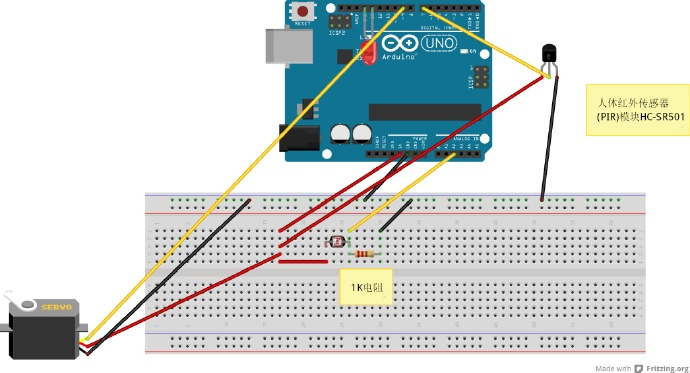

>使用 Arduino 光敏、人体红外传感器、舵机来控制灯光开启。这里以不破坏原则使用舵机推动开关来实现开灯和关灯。 实现目标：区域内光线强度不够时，同时有人在区域内驱动舵机推动开关开灯，无人在或光线强度足够则关灯


## 接线图



## 控制代码
<!-- more -->

``` C
#include <Servo.h> //舵机驱动库

Servo myservo; // 最多可以控制8路舵机
/**
 *  光敏 pin 2
 *  红外 pin 7
 *  舵机 pin 9
 *  [LED] pin 13
 */
// 光敏 接在   pin 2
int brightPin = 2; 
// 光值
int brightVal = 0;
// 小于此值时 开灯
int minLight = 250;
// LED 13号口
int ledPin = 13;
// 光线状态
//int brightState = HIGH;
// 红外感应 pin 7
int infraredPin = 7;
// 人感应状态
int personState = LOW;
// light 状态
int lightState = LOW;
// 舵机 pin 9
int switchPin = 9;
//打开灯
int openLight = HIGH;
//关闭灯
int closeLight = LOW;
//等待 1.5s 后 关灯 1.5 继续检测是否有人运动 弥补 传感器 人未动无法检测的问题
unsigned long delayMillis = 2000;
//传感器最后更新时间 
unsigned long lastMillis = 0;
int lightOpen = 70; //开灯角度
int lightClose = 180; //关灯角度
  
void setup() {
  // LED 输出
  pinMode(ledPin, OUTPUT); 
  // 红外输入
  pinMode(infraredPin, INPUT);
  // 舵机控制信号引脚 
  myservo.attach(switchPin);

  //串口调试
  Serial.begin(9600);

  //90 度 默认居中
  myservo.write(90);

}

void loop() { 

  //读取当前角度
  int nowState = myservo.read();
  Serial.print("nowState -> ");
  Serial.println(nowState);

  // 防止人为控制开关 推动舵机方向错误 刷新舵机方向与灯状态值一致
  if (lightOpen == nowState){
    Serial.print("open with high state\n\n");
    lightState = HIGH;
  }
  if (lightClose == nowState){
    Serial.print("open with low state\n\n");
    lightState = LOW;
  }
  
  //当前光状态
  int brightState = detectiveBright();
  //保存人是否存在状态
  int personState = detectivePerson();

    // 只要取到人存在 就记录一下 时间
  if (personState){
    lastMillis = millis(); // 记录一下 成功取到 的时间
  }
  if (false == brightState){ //光线不足
    // 刷新状态值保持一致性
    lightState = LOW;

    // 无光 时 只有2种情况需要操作
    // 1 有人 无灯 => 开灯
    // 2 有灯 无人 => 关灯
    if (personState && LOW == lightState){ //有人 且 无灯
      switchLight(openLight); //开灯
      lastMillis = millis();
      Serial.print("first start the light,the lastmillis is:"); 
      Serial.println(lastMillis); 
    }else if (false == personState && HIGH == lightState){ // 有灯 无人
      // 无特殊原因无此情况
      Serial.print(" turn off:"); 
      Serial.println(brightState); 
      switchLight(closeLight);
    }
  }else{ //光线充足
    lightState = HIGH;
    
    if (HIGH == lightState && false == personState){ //有光 有灯 无人
       unsigned long currentMillis = millis();
       if ((currentMillis - lastMillis) > delayMillis){ //延迟 n 秒关灯
          Serial.print(" turn off:"); 
          Serial.println(lastMillis); 
          switchLight(closeLight); //关灯
          lastMillis = 0;
        }else{
           //虽然达到关灯要求 但需要 延迟 n 秒
           //继续判断是否有人
          unsigned long check = currentMillis - lastMillis;
          Serial.print("still have time to turn off:"); 
          Serial.println(check); 
        }       

    }
  }

  // 0.1秒查看一次
  delay(100);       
}

//检查光源是否充足
bool detectiveBright() {
  // 讀取光敏電阻並輸出到 Serial Port 
  brightVal = analogRead(brightPin);
  //Serial.print("detectiveBright -> brightVal: ");
  //Serial.println(brightVal);   

  // 光線不足
  if (brightVal < minLight){
    //brightState = LOW;
    //Serial.print("brightState = LOW; ");
    return false;
  }else{ //光线充足 ok
    //brightState = HIGH;
    //Serial.print("brightState = HIGH; ");
    return true;
  }
}

//检查 160度内 是否有人感应
bool detectivePerson() {
  int detectiveNum = 0;
  for (int i = 0; i < 20; i++){
      personState = digitalRead(infraredPin); 
      if (HIGH == personState){
        detectiveNum++;
        delay(5);
      }
  }

  //有人的时候输出高电平1 无人0
  Serial.print("detectivePerson -> detectiveNum: ");
  Serial.println(detectiveNum); 
  // 有人情况超过一半 视为有人
  if (detectiveNum >= 10){
    Serial.print("perple on\n");
    return true;
  }else{
    Serial.print("perple off\n");
    return false;
  }
}

// 开灯 OR 关灯
void switchLight(int state) {

  //读取当前角度
  int nowState = myservo.read();

  // 0 - 180 度
  // 输入对应的角度值，舵机会转到此位置
  if (state == openLight && lightOpen != nowState){ //打开
    Serial.print("open");
    myservo.write(lightOpen);              
  }
  
  if (state == closeLight && lightClose != nowState) {  //关闭
    Serial.print("close");
    myservo.write(lightClose);
  }

  // 更新灯状态
  lightState = state;

  //开或关灯 时 LED显示
  digitalWrite(ledPin, lightState); // turn ON/OFF LED

  Serial.print("switchLight(): ");
  Serial.println(lightState);
}
```


>13号口LED灯仅调试时使用，测试时需拿下LED灯，LED亮会影响光敏判断流程 舵机最好单独供电，人体红外探测范围约160度左右不够时可多加几位人体红外，面板包仅测试时使用，长期使用可能会不稳定